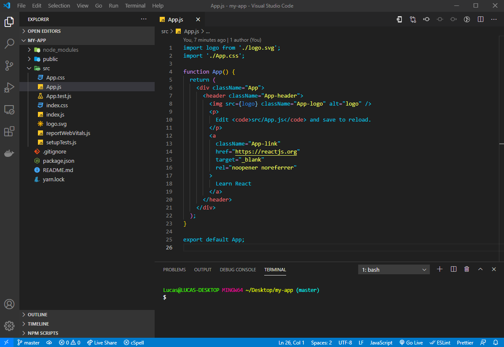

<h1 align="center">
  
   
  Draven for <a href="https://code.visualstudio.com/">Visual Studio Code</a>
   
</h1>

  <strong>Draven is a dark theme for Visual Studio Code</strong>.

  

  

<h1 align="center">
  
</h1>

## Install

All instructions can be found at [INSTALL.md](INSTALL.md).

## License

This project has the [MIT license](LICENSE).
